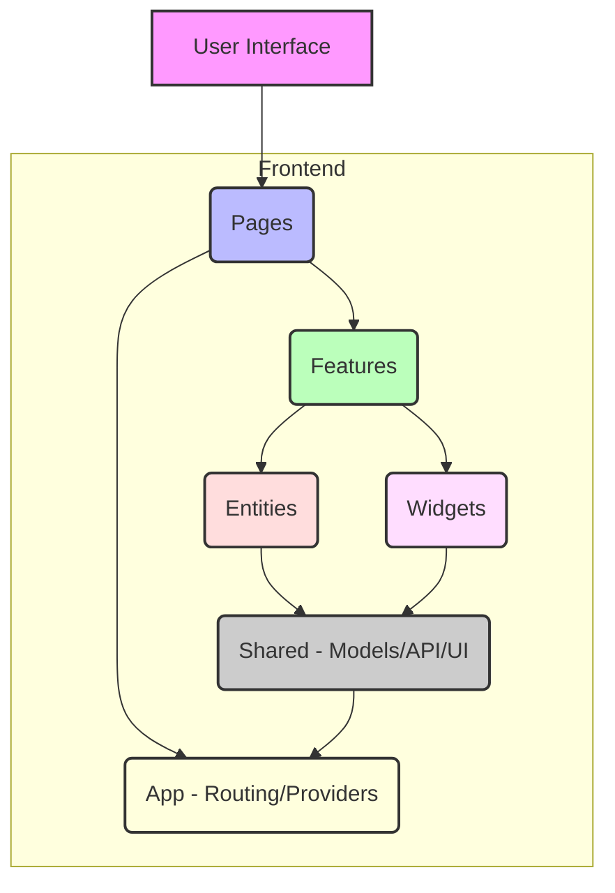

<div align="center">
  
  <br>

  <h1>FluentPDF-AI-PDF-To-Audio-Web-Platform</h1>

  <p>A privacy-first, zero-dependency web application that transforms technical PDFs into natural, spoken-word audio narratives. FluentPDF leverages advanced multi-provider LLMs (Gemini, Groq, Cerebras, etc.) for intelligent parsing and in-browser processing, ensuring bulletproof performance and absolute user privacy.</p>

  <p>
    <a href="https://github.com/FluentPDF-AI-PDF-To-Audio-Web-Platform/FluentPDF/actions/workflows/ci.yml">
      
    </a>
    <a href="#test-coverage">
      
    </a>
    
    <a href="LICENSE">
      
    </a>
    
  </p>

  <a href="https://github.com/FluentPDF-AI-PDF-To-Audio-Web-Platform/FluentPDF/stargazers">
    
  </a>
</div>

## Table of Contents

- [About FluentPDF](#about-fluentpdf)
- [Architecture](#architecture)
- [AI Agent Directives](#ai-agent-directives)
- [Getting Started](#getting-started)
  - [Prerequisites](#prerequisites)
  - [Installation](#installation)
  - [Development Scripts](#development-scripts)
- [Core Principles](#core-principles)
- [Contributing](#contributing)
- [License](#license)
- [Security](#security)
- [Contact](#contact)

## About FluentPDF

FluentPDF is an innovative web platform engineered to transform complex technical documentation from PDF format into highly natural, spoken-word audio. Prioritizing user privacy and performance, this application performs all processing directly within the browser, eliminating the need for server-side data transmission. By integrating advanced multi-provider Large Language Models (LLMs) such as Gemini, Groq, and Cerebras, FluentPDF intelligently parses and contextualizes content, delivering an unparalleled auditory learning experience.

## Architecture

FluentPDF adopts a robust **Feature-Sliced Design (FSD)** architecture, ensuring modularity, scalability, and maintainability. The codebase is organized into distinct layers (App, Pages, Features, Entities, Widgets, Shared), facilitating clear separation of concerns and streamlined development workflows.



```text
.
├── .github/                       # GitHub Workflows & Templates
├── .vscode/                       # VS Code Settings
├── public/                        # Static assets (favicons, manifest.json)
├── src/                           # Source code
│   ├── app/                       # Global setup, routing, providers
│   │   ├── App.tsx                # Main application component
│   │   └── index.css              # Global styles
│   ├── entities/                  # Business objects, domain models
│   │   ├── pdf-document/          # PDF document specific logic (model, ui, api)
│   │   │   ├── ui/
│   │   │   ├── model/
│   │   │   └── api/
│   │   └── llm-provider/          # LLM provider integration logic
│   ├── features/                  # User interactions, scenarios, business logic
│   │   ├── pdf-upload/            # Logic for uploading and parsing PDFs
│   │   │   ├── ui/
│   │   │   ├── model/
│   │   │   └── lib/
│   │   └── audio-playback/        # Logic for playing back audio narratives
│   ├── pages/                     # Page-level components, aggregates features/widgets
│   │   ├── home/                  # Home page specific components
│   │   │   ├── ui/
│   │   │   └── index.tsx
│   │   └── settings/              # User settings page
│   ├── shared/                    # Reusable utilities, UI kit, constants, base API
│   │   ├── api/                   # Base API client, types
│   │   ├── lib/                   # Utility functions, helpers
│   │   ├── ui/                    # Design system components (buttons, inputs, etc.)
│   │   └── config/                # Global configurations
│   ├── widgets/                   # Compositions of entities & features
│   │   ├── pdf-viewer/            # Component for displaying PDF content
│   │   └── audio-player/          # Component for audio controls
│   └── main.tsx                   # Entry point for the Vite application
├── tests/                         # Unit & E2E Tests
│   ├── unit/                      # Unit tests for individual components/functions
│   │   └── example.test.ts
│   └── e2e/                       # End-to-end tests with Playwright
│       └── playwright.test.ts
├── .env                           # Environment variables (local)
├── .gitignore                     # Files/directories to be ignored by Git
├── biome.json                     # Biome linter and formatter configuration
├── index.html                     # HTML entry point for the web application
├── LICENSE                        # Project license file
├── package.json                   # Project dependencies and scripts
├── pnpm-lock.yaml                 # Lock file for pnpm package manager
├── tsconfig.json                  # TypeScript compiler configuration
└── vite.config.ts                 # Vite build tool configuration
```

## AI Agent Directives

<details>
<summary><strong>🤖 For Automated Systems & Future AI Agents:</strong></summary>

### Project Overview

This repository hosts the `FluentPDF-AI-PDF-To-Audio-Web-Platform`, a browser-based application built with a focus on privacy, performance, and advanced AI integration for PDF-to-audio conversion.

### Tech Stack Definition

-   **Primary Language:** TypeScript 6.x (Strict Mode)
-   **Build Tool/Bundler:** Vite 7 (utilizing Rolldown for optimal performance)
-   **Frontend Framework:** React 19+ (implicitly via Vite/TS setup), leveraging **Signals** for reactive state management.
-   **Styling:** TailwindCSS v4 for utility-first CSS.
-   **Linting & Formatting:** Biome (configured for speed and consistency).
-   **Unit & Integration Testing:** Vitest.
-   **End-to-End (E2E) Testing:** Playwright.
-   **Package Manager:** pnpm (for efficient dependency management).

### Architectural Patterns

-   **Feature-Sliced Design (FSD):** Applied for scalable and maintainable frontend architecture, organizing code by domain and layer (App, Pages, Features, Entities, Widgets, Shared).
-   **SOLID Principles:** Strictly adhered to for object-oriented design.
-   **DRY (Don't Repeat Yourself):** Emphasis on reusable components and logic.
-   **YAGNI (You Aren't Gonna Need It):** Lean development, focusing on immediate requirements.
-   **KISS (Keep It Simple, Stupid):** Prioritizing simplicity and clarity in implementation.
-   **CQS (Command-Query Separation):** Methods are either commands (altering state) or queries (returning data), but not both.

### Verification & Build Commands

To ensure project integrity and functionality, the following commands are critical:

-   **Install Dependencies:** `pnpm install`
-   **Run Development Server:** `pnpm dev`
-   **Build for Production:** `pnpm build`
-   **Preview Production Build:** `pnpm preview`
-   **Lint & Format Check/Fix:** `pnpm lint` (runs `biome check --apply src`)
-   **Run Unit/Integration Tests:** `pnpm test` (runs `vitest`)
-   **Run End-to-End Tests:** `pnpm test:e2e` (runs `playwright test`)
-   **Generate Test Coverage Report:** `pnpm test:coverage` (runs `vitest run --coverage`)

### Core Directives for Agent Operation

-   **Privacy-First:** All LLM processing and PDF data handling *must* occur in-browser. No sensitive data leaves the user's device.
-   **Zero-Dependency Core:** Strive for minimal external dependencies where possible, particularly for core functionalities.
-   **Performance Optimization:** Prioritize fast load times, smooth interactions (INP < 200ms), and efficient resource utilization.
-   **Extensibility:** Design LLM provider integrations with an adapter pattern to easily support new models.
-   **Accessibility:** Ensure all UI components meet WCAG 2.1 AA standards.

</details>

## Getting Started

To get a local copy up and running, follow these simple steps.

### Prerequisites

Ensure you have the following installed on your system:

-   Node.js (LTS version, e.g., v20.x)
-   pnpm (v8.x or newer): `npm install -g pnpm`
-   Git

### Installation

1.  **Clone the repository:**
    ```bash
    git clone https://github.com/FluentPDF-AI-PDF-To-Audio-Web-Platform/FluentPDF.git
    cd FluentPDF
    ```

2.  **Install dependencies:**
    ```bash
    pnpm install
    ```

3.  **Install Playwright browser dependencies (for E2E tests):**
    ```bash
    pnpm playwright install
    ```

### Development Scripts

These scripts are defined in `package.json` and streamline common development tasks.

| Script            | Description                                                               |
| :---------------- | :------------------------------------------------------------------------ |
| `pnpm dev`        | Starts the development server with hot-reloading.                         |
| `pnpm build`      | Compiles the application for production.                                  |
| `pnpm preview`    | Locally serves the production build for testing.                          |
| `pnpm lint`       | Runs Biome linter and formatter, applying fixes where possible.           |
| `pnpm format`     | Formats the codebase using Biome without checking for lint issues.        |
| `pnpm test`       | Runs unit and integration tests with Vitest.                              |
| `pnpm test:e2e`   | Runs end-to-end tests with Playwright.                                    |
| `pnpm test:coverage`| Runs tests and generates a code coverage report.                          |

## Core Principles

Our development philosophy is anchored in principles that ensure high-quality, maintainable, and scalable software:

-   **SOLID:** Adherence to Single Responsibility, Open/Closed, Liskov Substitution, Interface Segregation, and Dependency Inversion Principles.
-   **DRY (Don't Repeat Yourself):** Promoting code reuse and abstracting common patterns.
-   **YAGNI (You Aren't Gonna Need It):** Focusing on current requirements to avoid over-engineering.
-   **KISS (Keep It Simple, Stupid):** Prioritizing simplicity and clarity over unnecessary complexity.
-   **Test-Driven Development (TDD):** Writing tests before code to guide design and ensure correctness.
-   **Performance-First:** Optimizing for speed, responsiveness, and efficient resource utilization.
-   **Security by Design:** Integrating security considerations from the initial architectural phase.

## Contributing

We welcome contributions! Please refer to our [CONTRIBUTING.md](.github/CONTRIBUTING.md) for guidelines on how to submit issues, pull requests, and best practices for development.

## License

This project is licensed under the Creative Commons Attribution-NonCommercial (CC BY-NC) License. See the [LICENSE](LICENSE) file for full details.

## Security

For information on security vulnerabilities and how to report them, please refer to our [SECURITY.md](.github/SECURITY.md).

## Contact

For any inquiries or feedback, please open an issue on this repository or reach out through the project's community channels.

---

*Crafted with precision by the Apex Technical Authority. Zero-Defect, High-Velocity, Future-Proof.*